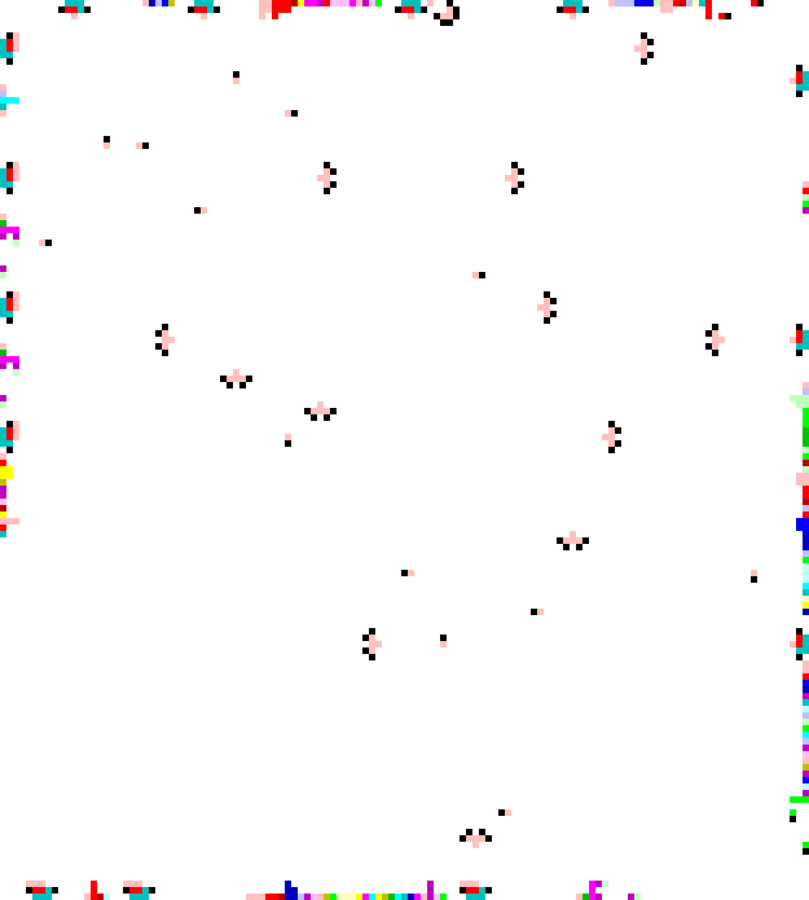
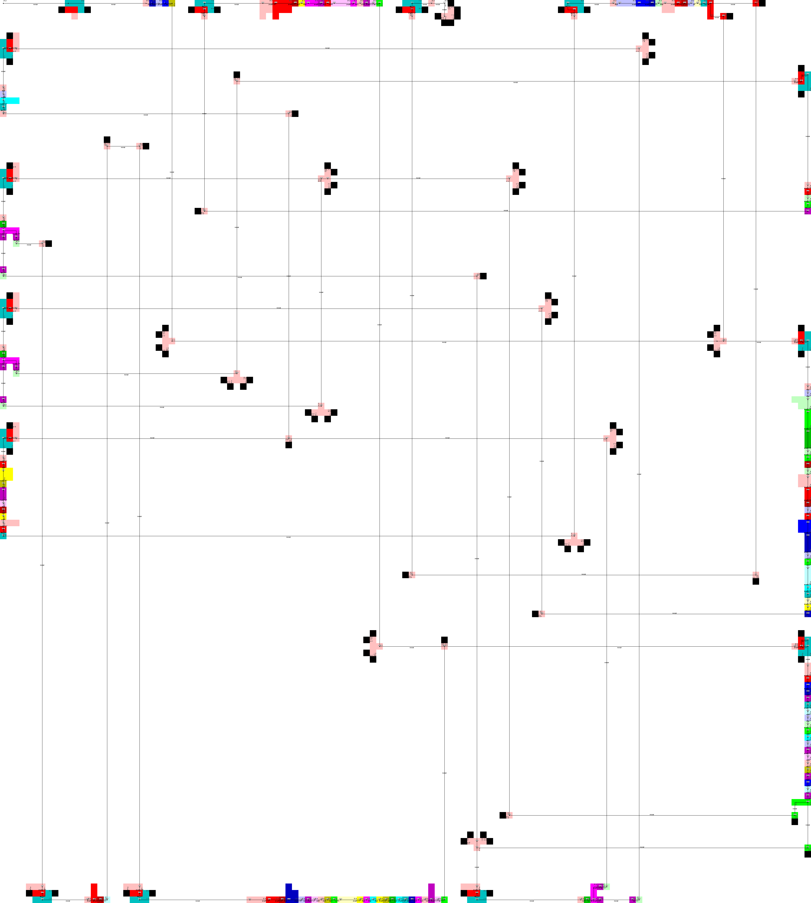

# GridPietGenerator
Automatic source-code generator of Piet, the esoteric programming language

## Readme in English
README in English may be coming soon...

## 概要
難解プログラミング言語Pietのソースコード画像自動生成ツール(C++)です。

テキストで記述した処理フローファイルを入力し、
対応するPietのソースコード画像を自動生成します。

将来的に、画像への自然なPietコード埋め込みを目標としています。

### Piet
PietはDavid Morgan-Mar氏により開発された
画像をソースコードとする難解プログラミング言語です。
+ [Piet](https://www.dangermouse.net/esoteric/piet.html)

### ディレクトリの説明
+ src : ソースコード
+ samples : 入力となる「処理フローファイル」のサンプル
  + fact.txt : 10の階乗を計算するプログラム
  + euclid.txt : ユークリッドの互除法プログラム
  + fizz_buzz.txt : 入力された値までのFizz Buzzを表示するプログラム
  + FL/ : サンプルファイルの改行コードをLFにしたもの
  + outputImages/ : 出力された画像ファイルの例（準備中…）

## 使用例
1. 処理フローファイルを用意します。例えばFizz Buzzの処理を記述した[こちらのファイル](samples/fizz_buzz.txt)。

2. ジェネレータに処理フローファイルを入力すると、Pietソースコード画像が出力されます。
```
./GridPietGenerator fizz_buzz.txt
```

> 出力画像の例(.ppm→.pngに変換)
> 

3. 動作確認をします。Pietインタプリタのひとつである[npiet](https://www.bertnase.de/npiet/)(Erik Schoenfelder氏製作)を使用します。

> npietによる出力
> ```
> ? 30
> 1 2 Fizz 4 Buzz Fizz 7 8 Fizz Buzz 11 Fizz 13 14 FizzBuzz 16 17 Fizz 19 Buzz Fizz 22 23 Fizz Buzz 26 Fizz 28 29 FizzBuzz
> ```

> npietによるトレース結果
> 

## GridPietGeneratorの特徴
+ **なるべく出力画像が細長くならない**ようにしました。（もちろん処理フローの構造にも依存します。）
+ **黒ブロックの使用を極力控えています。**
+ **画像中央に多くの余白を作る**ため、画像端をメイン処理部に、画像中央を状態遷移時の通路にしました。
  + そのため、インタプリタの動きをトレースすると、上の画像のように画像中央に格子状の軌跡が現れます。

## 開発言語・環境など
C++、Visual Studio 2017使用。

## ビルド
### 要件
C++のコンパイラのみ。特別なライブラリのインストールは不要。

### 手順
+ ライブラリ不要のため、srcファイル内のcppファイルを直接コンパイルすることもできます。
```
g++ -o GridPietGenerator GridPietGenerator.cpp
g++ -o GridPietInterpreter GridPietInterpreter.cpp
```

+ cmakeも使えます。
  + 要件：version >= 2.8


## 使い方
+ GridPietGenerator：処理フローファイルからPietソースコード画像(.ppm形式)を出力するジェネレータ。

```
./GridPietGenerator (処理フローファイル名)
```
出力ファイル名は「処理フローファイル名+.ppm」です。

#### 処理フローファイルについて
+ Pietにさせたい処理をテキストで記述したものです。
+ 詳細は[こちら](man/flowfile.md)。

#### 出力画像ファイル
現在、ppm形式での出力のみとなります（自力で実装できそうなのがこれだけだったため…）。

## 画像生成アルゴリズム
[こちら](man/algorithm.md)

## 出力されたPietコードの実行方法
本プログラムにPietのインタプリタは含まれません。
[こちら](https://www.dangermouse.net/esoteric/piet/tools.html)でPietのインタプリタが紹介されています。

## ライセンス
BSD 3-Clause License ([LISENCE](LICENSE))参照

## 問合せ / Contact
Y-mos

E-mail:ymos.36e17a7047@gmail.com

