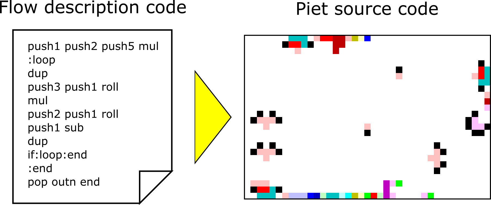

# GridPietGenerator
Automatic source-code generator of Piet, the esoteric programming language

## Readme in English
README in English may be coming soon...

## 概要
難解プログラミング言語[Piet](https://www.dangermouse.net/esoteric/piet.html)の
ソースコード画像自動生成ツール(C++)です。
テキストで記述された処理フローからPietソースコードを生成します。



## 手順
1. Pietに実行させる処理フローをテキストファイルに保存する。（処理フローは[独自の言語](man/flowfile.md)で記述する。）
2. PietInterpreterで処理フローが正しく動くか確認する。
3. PietGeneratorで処理フローを画像に変換する。
4. やったぜ。

## 使用例
「10の階乗を計算するプログラム」を例にあげます。

### 処理フローの記述
処理フローは以下のようになります。これを"fact.txt"として保存します。
記述方法は[こちら](man/flowfile.md)を参照してください。
```
# calculate 10!=10x9x8x7x6x5x4x3x2x1=3,628,800
push1 push2 push5 mul
:loop
dup
push3 push1 roll
mul
push2 push1 roll
push1 sub
dup
if:loop:end
:end
pop outn end
```

### 処理フローの動作確認
GridPietInterpreterを使うと、テキストファイルの処理フローを直接実行できます。
Pietソースコードを出力する前に動作確認ができます。
（もちろん、Pietソースコードを出力した後に、PietインタプリタでデバッグしてもOKです。）

```
./GridPietInterpreter fact.txt
```

実行例は以下の通りです。

```
=== Contents of Flow Description File (fact.txt) ===
push1 push2 push5 mul
:loop
 ... (中略：読み込まれたファイルがそのまま出力されます。) ...
:end
pop outn end

=== /Contents of Flow Description File (fact.txt) ===

===PietInterpreter - Commands [00000042DD8FF600]
0-1 | push1
0-2 | push2
0-3 | push5
0-4 | mul
1-1 | :loop
 ... (中略：読み込まれた命令が、以下の形式で順に出力されます。) ...
 ... ([テキスト中の行数]-[行内での順番] | [読み込んだ命令]) ...
9-1 | :end
10-1 | pop
10-2 | outn
10-3 | end


 ... (以下、インタプリタの各ステップにおける状態を出力します。) ...
===PietInterpreter [00000042DD8FF600]
cnt :1
pc  :1
cur : push1 @ l.0-1
next: push2 @ l.0-2
stack: [00000 :     1]
output:


===PietInterpreter [00000042DD8FF600]
cnt :2
pc  :2
cur : push2 @ l.0-2
next: push5 @ l.0-3
stack: [00000 :     1] [00001 :     2]
output:

 ... (出力形式は以下の通りです。) ...
===PietInterpreter [00000042DD8FF600]
cnt :18                                (プログラム開始時点からのステップ数)
pc  :5                                 (次ステップでのプログラムカウンタの値)
cur : :loop @ l.1-1                    (直前に実行した命令)
next: dup @ l.2-1                      (次ステップで実行する命令)
stack: [00000 :    10] [00001 :     9] (スタックの状態 [ボトムからの距離 : 値])
output:                                (現時点までの出力結果)
 ...  ...

===PietInterpreter [00000042DD8FF600]
cnt :137
pc  :20
cur : outn @ l.10-2
next: end @ l.10-3
stack:
output:
3628800
```

### Pietソースコードの出力
GridPietGeneratorを使うと、テキストファイルからPietソースコード画像を生成できます。
```
./GridPietGenerator fact.txt -o pietSource.ppm
```

このコマンドを実行するとPietソースコード画像"pietSource.ppm"が出力されます。
出力画像のフォーマットはバイナリppm形式です。
> 出力画像の例
> 

## 特徴
+ 出力画像はほぼ正方形になるようにしています。
+ 黒ブロックの使用を極力控えています。
+ 画像端で処理フローの大部分を処理し、画像中央には多くの余白ができます。
+ [PietEmbedder](https://github.com/Y-mos/PietEmbedder)と組み合わせると、任意の画像にPietソースコードを埋め込めます。

## アルゴリズム
概要は[こちら](man/algorithm.md)

## ビルド
### 要件
C++のコンパイラのみ。特別なライブラリのインストールは不要。

### 手順
+ ライブラリ不要のため、srcファイル内のcppファイルを直接コンパイルすることもできます。
```
g++ -o GridPietGenerator GridPietGenerator.cpp
g++ -o GridPietInterpreter GridPietInterpreter.cpp
```

+ cmakeも使えます。
  + 要件：version >= 2.8
```
git clone https://github.com/Y-mos/GridPietGenerator.git
cd GridPietGenerator
mkdir build
cd build
cmake ..
make
```

## ライセンス
BSD 3-Clause License ([LISENCE](LICENSE))参照

## 問合せ / Contact
Y-mos

twitter:[Y-mos](https://twitter.com/ymos3327)


