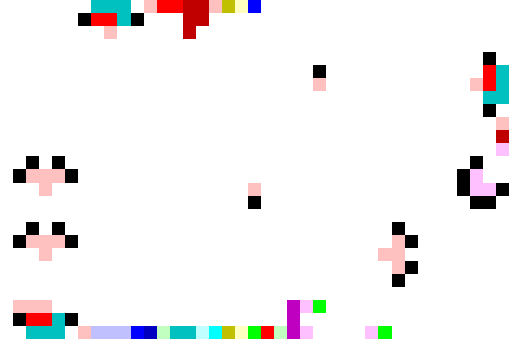

# GridPietGenerator
Automatic source-code generator of Piet, the esoteric programming language

## Readme in English
README in English may be coming soon...

## 概要
難解プログラミング言語[Piet](https://www.dangermouse.net/esoteric/piet.html)の
ソースコード画像自動生成ツール(C++)です。
テキストで記述された処理フローからPietソースコードを生成します。


## 手順
1. Pietに実行させる処理を「[処理フロー言語](man/flowfile.md)」で記述し、「処理フローファイル」に保存する。
2. PietInterpreterで処理フローファイルが正しく動くか確認する。
3. PietGeneratorで処理フローファイルを画像に変換する。
4. やったぜ。

## 使用例
1. 10の階乗を計算するプログラム

処理フロー言語は次のようになります。
```
# calculate 10!=10x9x8x7x6x5x4x3x2x1=3,628,800
push1 push2 push5 mul
:loop
dup
push3 push1 roll
mul
push2 push1 roll
push1 sub
dup
if:loop:end
:end
pop outn end
```

これをファイルに保存し、PietGeneratorで変換すると次のようが画像が出力されます。
> 出力画像の例(.ppm→.pngに変換)
> 

2. Fizz Buzz

処理フローファイルと出力画像は以下の通りです。
```
# --- iteration number ---
inn
# --- counter ---
push1
# --- check ---
:check
dup dup push5 push3
push3 push1 roll
mod dup
push4 push2 roll
mod dup
push4 push3 roll mul
push3 push1 roll
# --- checkFizz ---
:checkFizz
if:checkBuzz:
push1 not
goto:Fi
# --- checkBuzz ---
:checkBuzz
if:showNumber:
push1
goto:Bu
# --- showNumber if needed ---
:showNumber
if::increment
dup
outn
goto:increment
# --- display Fi
:Fi
push5 push7 mul dup
push2 mul outc
push3 mul outc
goto:zz
# --- display Bu
:Bu
push3 push2 dup push5
mul push1 add mul mul outc
push3 dup dup dup push1 add
mul push1 add mul mul outc
goto:zz
# --- display zz
:zz
push2 dup push1 add
dup push1 add
dup push1 add
mul mul push1 add mul
dup outc outc
if:showNumber:checkBuzz
# --- increment ---
:increment
push1 add
push4 dup push2 mul mul outc
# --- loop check ---
:loopCheck
dup
push3 push2 roll
dup
push4 push1 roll
gt
if:end:check
# --- end ---
:end
end
```

> 出力画像の例(.ppm→.pngに変換)
> 

このような複雑な処理もPietソースコードに変換します。

## 特徴
+ 出力画像のアスペクト比が1に近づくようにしており、出力画像が細長くなりにくいのが特徴です。
+ 黒ブロックの使用を極力控えています。
+ 画像中央に多くの余白ができます。
  + 画像端にメインの処理ブロックを配置し、画像中央を処理ブロック間の遷移用通路としたためです。
  + そのため、インタプリタの動きをトレースすると、画像中央に格子状の軌跡が現れます。

将来的にPietコードを任意の画像に埋め込みたいと考え、このような特徴を持つよう設計しました。

（追記）埋め込みソフトも作りました：[PietEmbedder](https://github.com/Y-mos/PietEmbedder)

## ビルド
### 要件
C++のコンパイラのみ。特別なライブラリのインストールは不要。

### 手順
+ ライブラリ不要のため、srcファイル内のcppファイルを直接コンパイルすることもできます。
```
g++ -o GridPietGenerator GridPietGenerator.cpp
g++ -o GridPietInterpreter GridPietInterpreter.cpp
```

+ cmakeも使えます。
  + 要件：version >= 2.8
```
git clone https://github.com/Y-mos/GridPietGenerator.git
cd GridPietGenerator
mkdir build
cd build
cmake ..
make
```

## 使い方
### GridPietInterpreter
###### コマンド
```
./GridPietInterpreter (処理フローファイル名)
```

###### 出力例
```
=== Contents of Flow Description File (fact.txt) ===
push1 push2 push5 mul
:loop
 ... (中略：読み込まれたファイルがそのまま出力されます。) ...
:end
pop outn end

=== /Contents of Flow Description File (fact.txt) ===

===PietInterpreter - Commands [00000042DD8FF600]
0-1 | push1
0-2 | push2
0-3 | push5
0-4 | mul
1-1 | :loop
 ... (中略：読み込まれた命令が、以下の形式で順に出力されます。) ...
 ... ([テキスト中の行数]-[行内での順番] | [読み込んだ命令]) ...
9-1 | :end
10-1 | pop
10-2 | outn
10-3 | end


 ... (以下、インタプリタの各ステップにおける状態を出力します。) ...
===PietInterpreter [00000042DD8FF600]
cnt :1
pc  :1
cur : push1 @ l.0-1
next: push2 @ l.0-2
stack: [00000 :     1]
output:


===PietInterpreter [00000042DD8FF600]
cnt :2
pc  :2
cur : push2 @ l.0-2
next: push5 @ l.0-3
stack: [00000 :     1] [00001 :     2]
output:

 ... (出力形式は以下の通りです。) ...
===PietInterpreter [00000042DD8FF600]
cnt :18                                (プログラム開始時点からのステップ数)
pc  :5                                 (次ステップでのプログラムカウンタの値)
cur : :loop @ l.1-1                    (直前に実行した命令)
next: dup @ l.2-1                      (次ステップで実行する命令)
stack: [00000 :    10] [00001 :     9] (スタックの状態 [ボトムからの距離 : 値])
output:                                (現時点までの出力結果)
 ...  ...

===PietInterpreter [00000042DD8FF600]
cnt :137
pc  :20
cur : outn @ l.10-2
next: end @ l.10-3
stack:
output:
3628800
```


### GridPietGenerator
###### コマンド
```
./GridPietGenerator (処理フローファイル名)
```
または
```
./GridPietGenerator (処理フローファイル名) (出力Pietソースコードファイル名)
```
または
```
./GridPietGenerator (処理フローファイル名) (出力Pietソースコードファイル名) (出力Piet配置ファイル名)
```

※1つ目のコマンドの場合、出力ファイル名は「処理フローファイル名＋.ppm」となります。
※3つ目のコマンドの場合のみ、「Piet配置ファイル」が出力されます。

###### 出力例
```
=== Contents of Flow Description File (fact.txt) ===
push1 push2 push5 mul
:loop
 ... (中略：読み込まれたファイルがそのまま出力されます。) ...
:end
pop outn end

=== /Contents of Flow Description File (fact.txt) ===

=== Commands ===
0-1 | push1
0-2 | push2
0-3 | push5
0-4 | mul
1-1 | :loop
 ... (中略：読み込まれた命令が、以下の形式で順に出力されます。) ...
 ... ([テキスト中の行数]-[行内での順番] | [読み込んだ命令]) ...
9-1 | :end
10-1 | pop
10-2 | outn
10-3 | end
=== /Commands ===

 ... (解析結果を出力します。デバッグ用なので詳細は割愛します。) ...
===PietBoard [00000098AEEFF0F0]
 - lastID = 2
 *BLOCK :0( hash : 0 )[000001AA776D57A8] :    [10,3] @ (pos,dir)=(0, 3) user[0,0]/sys[5,3]/buf[0,0]
 *BLOCK :1( hash : 3 )[000001AA776DFFC8] :    [14,3] @ (pos,dir)=(5, 3) user[6,3]/sys[8,3]/buf[0,0] outT=:loop
      0 | push1
      1 | push2
      2 | push5
      3 | mul
 *BLOCK :end( hash : 7 )[000001AA776E2448] :    [12,4] @ (pos,dir)=(0, 0) user[2,1]/sys[10,4]/buf[0,0]
      0 | pop
      1 | outn
      2 | end
 *BLOCK :loop( hash : 5 )[000001AA776E01F8] :    [30,3] @ (pos,dir)=(0, 1) user[14,1]/sys[16,3]/buf[0,0] outT=:loop outF=:end
      0 | dup
      1 | push3
      2 | push1
      3 | roll
      4 | mul
      5 | push2
      6 | push1
      7 | roll
      8 | push1
      9 | sub
     10 | dup
     11 | if:loop:end
 *JOINT [000001AA776E5250] @(18,10) ':1/T>(1)'->':1/T>>:loop(2)'
 *JOINT [000001AA776E52B0] @(2,10) ':1/T>>:loop(2)'->'>:loop(1)'
 *JOINT [000001AA776E5310] @(28,15) ':loop/T>(3)'->':loop/T>>:loop(2)'
 *JOINT [000001AA776E5370] @(2,15) ':loop/T>>:loop(2)'->'>:loop(1)'
 *JOINT [000001AA776E53D0] @(23,2) ':loop/F>(3)'->'>:end(0)'
 *PATH [000001AA776E2848] (:1/T>)==>(:1/T>>:loop) (pos, dir)=(18,S)
 *PATH [000001AA776E2CA8] (:1/T>>:loop)==>(>:loop) (pos, dir)=(10,W)
 *PATH [000001AA776E2AE8] (:loop/F>)==>(>:end) (pos, dir)=(23,N)
 *PATH [000001AA776E2BC8] (:loop/T>)==>(:loop/T>>:loop) (pos, dir)=(28,N)
 *PATH [000001AA776E4D98] (:loop/T>>:loop)==>(>:loop) (pos, dir)=(15,W)
 *PATH [000001AA776E1358] (>:1)==>() (pos, dir)=(7,N)
 *PATH [000001AA776E2928] (>:end)==>() (pos, dir)=(2,E)
 *PATH [000001AA776E2A08] (>:loop)==>() (pos, dir)=(2,S)


=== Output layout in ASCII ===
%%%%%%%333%333333333...................
......33333...33...v...................
........3.....3....v...................
...................v...................
...................v.................7.
...................v....%............77
...................v....%>>>>>>>>>>>777
...................v....^............77
...................v....^............7%
...................v....^.............7
...................v....^.............7
...................v....^.............7
..%.%..............v....^...........7.%
.%%%%%.............v....^..........77%%
...%<<<<<<<<<<<<<<<%....^..........7777
...v...............%....^...........77.
...v....................^..............
..%v%...................^.....%........
.%%%%%..................^.....%%.......
...%<<<<<<<<<<<<<<<<<<<<+<<<<%%........
...v....................^....^%%.......
...v....................^....^%........
...v....................^....^.........
.555..................555....^.........
.55555................5......^.........
..555%555555555555555555%%%%55.........
=== /Output layout in ASCII ===

=== Output text ===
=== /Output text ===
```

###### Piet配置ファイル
3つ目の引数でファイル名を指定した場合、同ファイル名で
「Piet配置ファイル」が出力されます。
これは、Pietソースコード画像をAscii文字で表記したもので、
各Codelの情報に加えPietインタプリタの移動経路の情報も
出力されます。

```
PIET TEXT DESCRIPTION
39,26
WWWWWWW333WRrr00R1Yb...................
......Krr3K...00...v...................
........R.....0....v...................
...................v...................
...................v.................K.
...................v....K............r3
...................v....R>>>>>>>>>>>Rr3
...................v....^............33
...................v....^............KW
...................v....^.............R
...................v....^.............0
...................v....^.............M
..K.K..............v....^...........K.W
.KRRRK.............v....^..........KMWW
...R<<<<<<<<<<<<<<<R....^..........KMMK
...v...............K....^...........KK.
...v....................^..............
..KvK...................^.....K........
.KRRRK..................^.....RK.......
...R<<<<<<<<<<<<<<<<<<<<+<<<<RR........
...v....................^....^RK.......
...v....................^....^K........
...v....................^....^.........
.RRR..................5Mg....^.........
.Krr3K................5......^.........
..333WRBBBb4G33Cc1YgrG5MWWWWMg.........
```

+ 1行目     : ヘッダ
+ 2行目     : 画像サイズ（横,縦）
+ 3行目以降 : ソースコード画像のCodel表示

||Red|Yellow|Green|Cyan|Blue|Magenta|
|-|-|-|-|-|-|-|
|Light|R|Y|G|C|B|M|
|Normal|r|y|g|c|b|m|
|Dark|0|1|2|3|4|5|

|Dir.|mark|
|-|-|
|Right|>|
|Down|v|
|Left|<|
|Up|^|
|Crossing|+|

+ K : Black
+ . : White or Blank
+ W : White (explicitly marked)

## 出力画像のフォーマット
バイナリppm形式で出力します。

## アルゴリズム
概要は[こちら](man/algorithm.md)

## ライセンス
BSD 3-Clause License ([LISENCE](LICENSE))参照

## 問合せ / Contact
Y-mos

E-mail:ymos.36e17a7047@gmail.com


